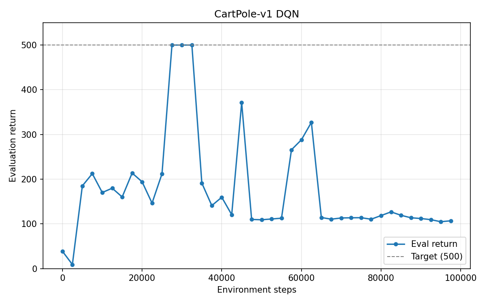
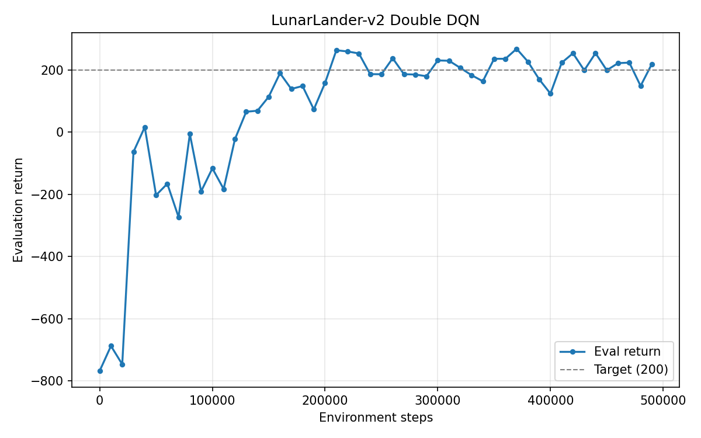
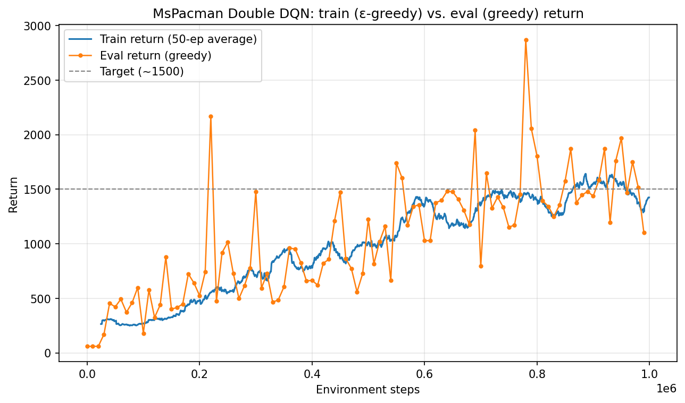
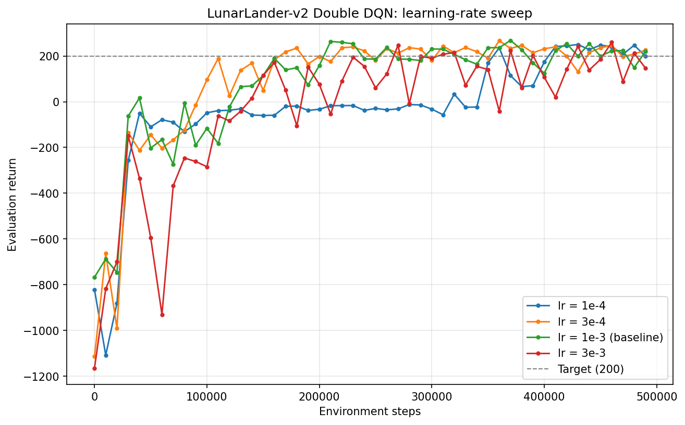
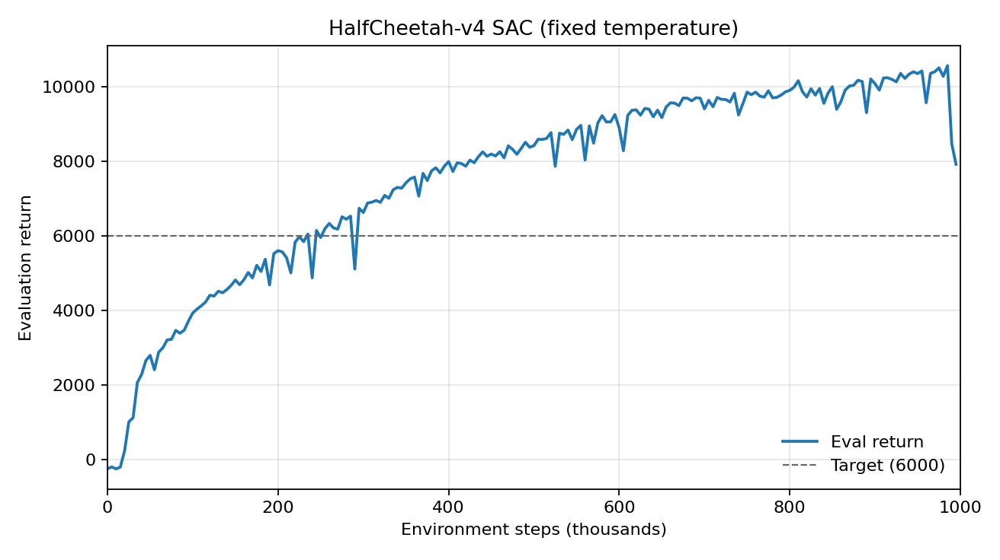
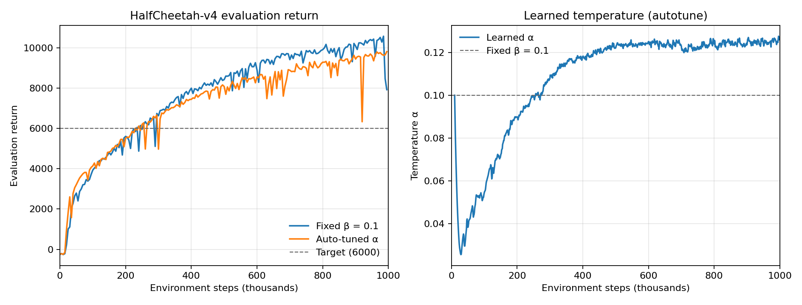
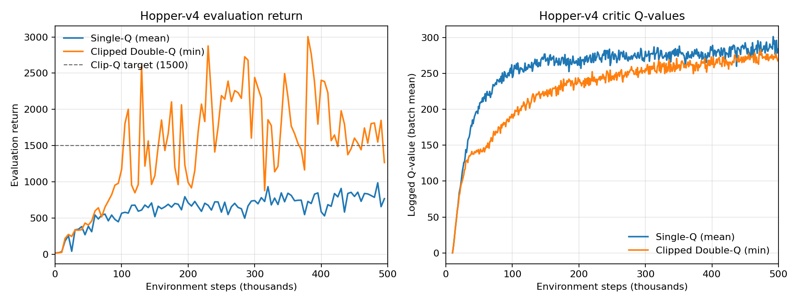

# Q-Learning and Soft Actor-Critic

Solutions for Homework 3 of UC Berkeley CS 285: Deep Reinforcement Learning (Spring 2026).

Original Starter Code: https://github.com/berkeleydeeprlcourse/homework_spring2026/tree/main/hw3

See [`hw3_handout.pdf`](./hw3_handout.pdf) in this folder for the full assignment overview.

This project implements two value-based deep RL algorithms from scratch: **DQN** (plus the Double-Q trick) for discrete action spaces, and **Soft Actor-Critic** for continuous ones. SAC is built up one piece at a time: bootstrapped critic, entropy bonus, reparametrized actor, learned temperature, clipped double-Q. These algorithms are applied to six different environments:

- **CartPole-v1** (DQN)
- **LunarLander-v2** (Double DQN)
- **MsPacman** (Double DQN, from Atari pixels)
- **HalfCheetah-v4** (SAC, fixed and adaptive temperature)
- **Hopper-v4** (SAC, single-Q and clipped double-Q)
- **InvertedPendulum-v4** (SAC sanity checks)

The main lesson learned is that bootstrapping a value function off its own predictions works, but it is biased and unstable by default, so most of what these algorithms do is reducing bias and instability in check.

## Summary of Results

| Run | Goal | Best result | |
|---|---|---|---|
| CartPole-v1, DQN | hit 500 once | **500** | pass |
| LunarLander-v2, Double DQN | hit 200 once | **268** | pass |
| MsPacman, Double DQN | hit ~1500 once | **2872** | pass |
| HalfCheetah-v4, SAC (fixed β) | hit 6000 once | **10570** | pass |
| HalfCheetah-v4, SAC (auto α) | comparison only | **9804** | pass |
| Hopper-v4, SAC single-Q | baseline | 985 | - |
| Hopper-v4, SAC clipped double-Q | hit 1500 once | **3005** | pass |

The InvertedPendulum sanity checks all passed too with Q-values settled around 5 with an untrained actor, entropy landed at 0.68 (~ log 2), and the finished agent scored 1000.

---

## DQN

### CartPole



Reaches 500 at 27.5k steps and stays at it for three evaluations, then falls back to around 110 for the rest of training.

That drop is normal for vanilla DQN, and it isn't the Q-values exploding. The critic reports about 61, which is roughly what a 110-step episode is actually worth. So the critic is correctly valuing a policy that got worse. In other words, the policy degraded, not the value estimates.

### LunarLander (Double DQN)



Crosses 200 at 210k steps, peaks at 268, and stays in the 150–270 range for the second half of training. There isn't a collapse like CartPole.

### MsPacman (Double DQN, from pixels)



1M steps, best evaluation score 2872, first crosses 1500 at 220k.

**Why do the two lines differ early on?** They are two different policies. Training uses ε-greedy (ε starts at 1.0 and decays to 0.01), compared to evaluation is always fully greedy. That results in three stages:

| Steps | Train | Eval | ε |
|---|---|---|---|
| 0–20k | 245 | 60 | ~1.0 |
| 50k–100k | 261 | 469 | 0.89 |
| 700k–1000k | 1452 | 1527 | 0.01 |

- **At the very start, eval is worse.** A greedy policy on an untrained network picks the same action over and over, so Ms. Pac-Man walks into a wall and dies right away (score 60). Random actions at least move around the maze and eat pellets by accident (score 245).
- **Then eval pulls ahead.** Once Q means something, greedy exploits it, while training is still random 70–90% of the time. And in MsPacman a random move often walks you into a ghost.
- **And then finally they meet.** With ε down at 0.01 the two policies are basically the same, and the curves overlap.

### Learning-rate sweep on LunarLander



Four learning rates, everything else identical.

| lr | Best | First ≥ 200 | Evals ≥ 200 (of 50) | Mean of last 20% |
|---|---|---|---|---|
| 1e-4 | 250 | 360k | 9 | 228 |
| 3e-4 | 267 | **170k** | **24** | 213 |
| 1e-3 (baseline) | **268** | 210k | 17 | 207 |
| 3e-3 | 260 | 270k | 8 | 154 |

**Why sweep the learning rate?** DQN doesn't regress onto a fixed target. It regresses onto a target the network itself produces. So the step size controls both how fast reward information spreads and how much the target jumps around underneath you. So it's the parameter where that trade-off shows up most clearly.

All four reach a similar *peak* (250–268), so peak score alone makes it look like the choice doesn't matter. But the difference is consistency. 3e-4 is the best learning rate: it gets there first and stays above 200 the most often. 1e-4 is just too slow (its Q-values only reach 41, less than half the others, so learning hasn't finished). 3e-3 is unstable and ends worst. One decade of learning rate is the difference between solving it by 170k and never really settling.

---

## SAC

### HalfCheetah, fixed temperature



Clears 6000 at 235k and tops out at 10570. Smooth learning.

### HalfCheetah, fixed vs. automatic temperature



| | Fixed β = 0.1 | Auto-tuned α |
|---|---|---|
| Best return | **10570** | 9804 |
| First ≥ 6000 | 235k | **230k** |
| Mean of last 20% | **9964** | 9349 |
| Final temperature | 0.100 | 0.127 |

**Does auto-tuning help?** Not really, it's about the same (maybe even slightly behind). The curves sit on top of each other for the first 300k steps and both cross 6000 at the same point. The fixed run ends ~6% ahead, which is small enough to be seed noise on a single-seed comparison. This is expected, as β = 0.1 was already well tuned for HalfCheetah, so there was nothing to gain. The real benefit is not having to pick a temperature by hand for a new environment.

**How does α move?** Down, then up, then flat. It helps to think of α as the price SAC pays to keep the policy random:

1. **It drops fast**, from 0.10 to 0.026 over the first ~29k steps. SAC is told to keep the policy's entropy above -6, but the untrained policy sits at +3.8, which is already far more random than required. It's getting that randomness for free, so α falls, and there's nothing worth paying for.
2. **Then it climbs back up** and flattens at ~0.127 around 500k. As the cheetah learns to run, the policy sharpens and its entropy falls past -6. The requirement is now being broken, so α rises to start paying for randomness again and keep the policy from going fully deterministic.

**Why does that shape appear?** HalfCheetah is dense-reward and never terminates, as every episode runs the full 1000 steps, and there's no way to fail catastrophically. Exploration is cheap early and precision matters late, and α illustrates that. Notably it settles ~27% *above* the hand-picked 0.1, and the final entropies agree (-5.8 auto vs -6.8 fixed), so the constraint wants a slightly more random policy than β = 0.1 gives. It found that on its own with no search, and cost nothing to do so.

### Hopper: single-Q vs. clipped double-Q



| | Single-Q | Clipped double-Q |
|---|---|---|
| Best return | 985 | **3005** |
| Evals ≥ 1500 (of 100) | **0** / 100 | **54** / 100 |
| Peak Q-value | **301** | 283 |

Clipped double-Q wins clearly. It beats 1500 on more than half its evaluations; single-Q never gets there once and flatlines around 600–800 after 100k.

**The overestimation: single-Q predicts the *higher* Q-values while earning the *lower* return.** A critic that's actually doing better should predict values its policy can deliver.

That happens because the actor is trained to maximize Q, so it actively hunts for actions where the critic guesses too high. With one critic, that inflated guess gets backed up into the target, which trains the critic higher, which the actor then chases - resulting in a loop. Taking the `min` of two critics breaks it, because an action only gets a high target if *both* critics like it.

Comparing the logged Q against a rough estimate of what the policy actually earns:

| Step | Single-Q (Q / actual) | Clip-Q (Q / actual) |
|---|---|---|
| 100k | 1.03 | 0.64 |
| 400k | **1.15** | 0.78 |

Single-Q starts about right and drifts up to a 15% overestimate (so the bias builds over time). Clipped double-Q stays pessimistic the whole way. So an underestimate gives the actor nothing to exploit (this is a rough check - logged Q averages over replay states, not start states).

---

## Project structure

```text
hw3/
├── src/
│   ├── agents/
│   │   ├── dqn_agent.py           # * DQN + Double-Q: eps-greedy, critic update, target sync
│   │   └── sac_agent.py           # * SAC: critic backup, entropy, reparam actor, alpha tuning
│   ├── networks/
│   │   ├── critics.py             # Q(s, a) MLP used by SAC
│   │   └── policies.py            # tanh-squashed Gaussian actor
│   ├── configs/
│   │   ├── dqn_config.py          # builds DQN nets/optimizers per env
│   │   ├── sac_config.py          # builds SAC nets/optimizers per env
│   │   └── schedule.py            # epsilon and learning-rate schedules
│   ├── infrastructure/
│   │   ├── replay_buffer.py       # standard + frame-stacking (Atari) buffers
│   │   ├── atari_wrappers.py      # MsPacman preprocessing
│   │   ├── distributions.py       # tanh transform for the squashed policy
│   │   ├── pytorch_util.py        # GPU/device setup
│   │   ├── log_utils.py           # CSV + W&B logging, checkpointing
│   │   └── utils.py               # rollout helpers
│   └── scripts/
│       ├── run_dqn.py             # * DQN training loop
│       └── run_sac.py             # * SAC training loop
├── experiments/
│   ├── dqn/                       # cartpole, lunarlander (+3 LR variants), mspacman
│   └── sac/                       # halfcheetah (+autotune), hopper (singleq/clipq), invertedpendulum
├── exp/                           # run outputs: log.csv, log.pkl, agent.pt, figures
├── summarize_runs.py              # per-run metric summaries from exp/*/log.csv
├── report_stats.py                # derived numbers quoted in this README
├── make_lr_sweep_plot.py          # rebuilds the learning-rate sweep figure
├── make_mspacman_plot.py          # rebuilds the train-vs-eval figure
└── hw3_handout.pdf
```

`*` marks the four files containing the actual algorithm implementations; everything else in `src/` is starter code. The unused Modal scripts (`src/scripts/modal_run_*.py`) are left in place but were not used, since all runs were local.

## Reproducing

```powershell
uv sync
uv run wandb login

# DQN
uv run src/scripts/run_dqn.py -cfg experiments/dqn/cartpole.yaml --eval_interval 2500 --seed 2
uv run src/scripts/run_dqn.py -cfg experiments/dqn/lunarlander.yaml --seed 1
uv run src/scripts/run_dqn.py -cfg experiments/dqn/mspacman.yaml
uv run src/scripts/run_dqn.py -cfg experiments/dqn/lunarlander_lr3e-4.yaml   # and lr1e-4, lr3e-3

# SAC
uv run src/scripts/run_sac.py -cfg experiments/sac/halfcheetah.yaml
uv run src/scripts/run_sac.py -cfg experiments/sac/halfcheetah_autotune.yaml
uv run src/scripts/run_sac.py -cfg experiments/sac/hopper_singleq.yaml
uv run src/scripts/run_sac.py -cfg experiments/sac/hopper_clipq.yaml
```

Roughly 11–12 hours total. The two HalfCheetah runs are ~2.5 h each, MsPacman ~1.4 h, each Hopper run ~1.5 h.

Helper scripts: `summarize_runs.py` prints per-run metric summaries, `report_stats.py` computes the derived numbers used above, and `make_lr_sweep_plot.py` / `make_mspacman_plot.py` rebuild those two figures.

## Caveats

- Single seed per configuration. The fixed-vs-auto HalfCheetah performance gap especially shouldn't be read as a real difference.
- The optional fixed-β sweep on HalfCheetah ({0.01, 0.05, 0.1, 0.5, 1.0}) was not run.

--- 

## Notes

- Entropy needs `.rsample()`, not `.sample()`.** With `.sample()` the action is detached from the policy parameters, so the gradient has zero mean and is pure noise. My first entropy-only run had entropy falling to -1.89 instead of rising. Switching to `.rsample()` gave 0.681, matching the expected log 2 ~= 0.693. Both runs are still in `exp/` if you want to compare.
- Everything ran locally on an RTX 5070 Ti Laptop GPU with `uv` and PyTorch 2.13 + CUDA 13.0. No Modal. 
- All runs are logged to W&B (project `hw3`) and to `exp/<run>/log.csv`. 
- Seed 1 was used everywhere except CartPole, which uses seed 2.

---

# Main takeaways

**Bootstrapping is the problem both algorithms are built around.** Learning a value function from its own predictions works, but nothing about it is stable by default. Almost every technique here exists to contain that: target networks, Double-Q, clipped double-Q, gradient clipping, learning-rate decay. 

**Big Q-values are not a sign of success.** Single-Q Hopper predicted the *highest* values of any run and finished with the worst return, never reaching 1500. The same pattern showed up in the LunarLander sweep, where lr = 3e-3 had the largest Q-values and the worst final performance. If the critic predicts more than the policy delivers, it's exploiting its own errors.

**Pessimism can be cheap insurance.** Clipped double-Q *underestimated* by 20–35% for the entire Hopper run and still tripled single-Q's return. So an underestimate gives the actor nothing to chase, while an overestimate hands it a direction to exploit. Being wrong in the safe direction beats being nearly right in the dangerous one.

**Instability doesn't always mean divergence.** CartPole hit 500, then collapsed to ~110 and stayed there, but the critic never blew up. It reported ~61, which is about what a 110-step episode is genuinely worth. The value function still worked, it's the policy is what fell apart. Worth checking which one actually broke before assuming the values diverged.